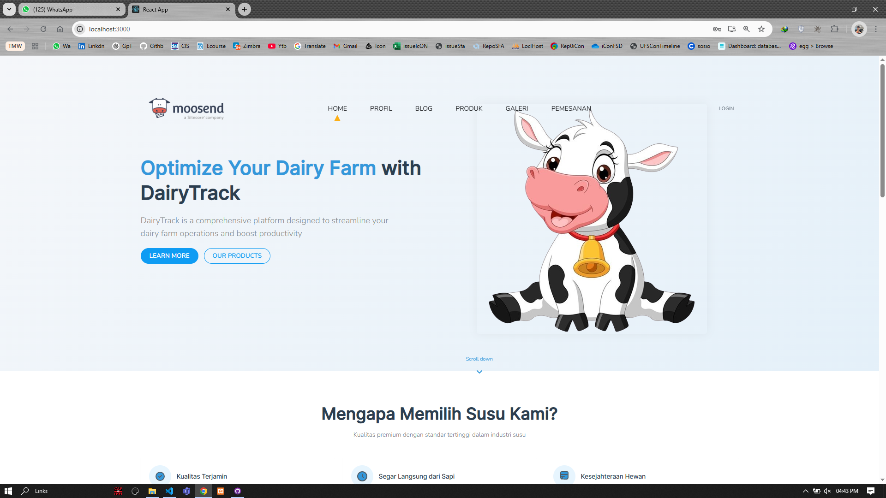
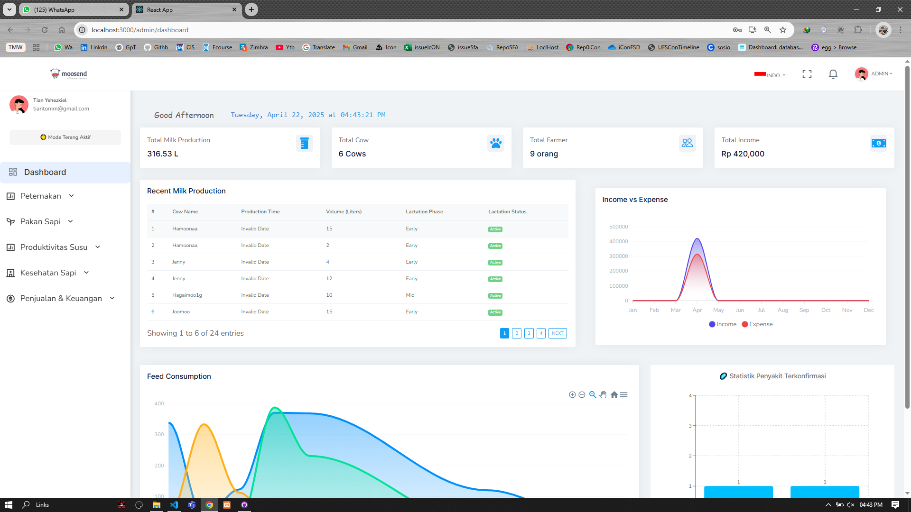

📌 DevelopmentOf-DairyTrack-Platform

DairyTrack is a smart dairy farm management platform that helps farmers efficiently track and manage milk production, cow health, feed scheduling, and milk sales. This system provides real-time insights and analytics to optimize dairy operations.

🚀 Key Features
✅ Milk Production Monitoring – Track and analyze daily milk production per cow or farm.
✅ Cow Health Tracking – Monitor cow health, detect issues early, and maintain medical records.
✅ Feed Scheduling – Plan and automate feeding schedules for optimal nutrition.
✅ Milk Sales Management – Record sales, generate reports, and manage transactions.
✅ Dashboard & Reports – Visualize key metrics with daily, weekly, and monthly insights.
✅ Notifications & Alerts – Get alerts for production drops, health concerns, and missed feedings.
✅ Export Data – Export reports to Excel/PDF for easy record-keeping.

🛠 Tech Stack
Backend: Flask (Python)
Frontend: React.js
Database: MySQL
Hosting: Cloud-based deployment
# Getting Started with Create React App

This project was bootstrapped with [Create React App](https://github.com/facebook/create-react-app).

## About the Application

This is a **Dairy Farm Management Dashboard** designed to provide insights and analytics for dairy farm operations. The dashboard includes features such as:
- Real-time greeting and current time display based on the user's local time.
- Key performance indicators (KPIs) such as total milk production, total cows, total farmers, and total income.
- Visualizations for recent milk sales, income vs. expenses, milk production vs. feed consumption, and confirmed disease statistics.

The application is built using React for the frontend and integrates with backend services for data visualization and management.

## Preview

Below are some previews of the application:

### Preview 1

This image shows the main dashboard of the application, where users can view key metrics and navigate through the platform.

### Preview 2

This image highlights the detailed analytics page, providing insights into data trends and performance.

## Available Scripts

In the project directory, you can run:

### `npm start`

Runs multiple services concurrently:
- React frontend (`react-start`)
- Flask backend (`flask-start`)
- Node.js API (`node-api`)
- Django services (`django-start` and `django-start2`)

This uses the `concurrently` package to manage multiple processes. Each service runs in the background.

### `npm run react-start`

Runs the React app in development mode.\
Open [http://localhost:3000](http://localhost:3000) to view it in your browser.

### `npm run flask-start`

Starts the Flask backend located in `../dairytrack-api/MilkProduction` on port `5000`.

### `npm run node-api`

Starts the Node.js API located in `../dairytrack-api/FeedConsumption`.

### `npm run django-start`

Starts the Django service for `HealthCheck` on port `5002`.

### `npm run django-start2`

Starts the Django service for `Selling` on port `5001`.

### `npm test`

Launches the test runner in the interactive watch mode.\
See the section about [running tests](https://facebook.github.io/create-react-app/docs/running-tests) for more information.

### `npm run build`

Builds the app for production to the `build` folder.\
It correctly bundles React in production mode and optimizes the build for the best performance.

The build is minified and the filenames include the hashes.\
Your app is ready to be deployed!

See the section about [deployment](https://facebook.github.io/create-react-app/docs/deployment) for more information.

### `npm run eject`

**Note: this is a one-way operation. Once you `eject`, you can't go back!**

If you aren't satisfied with the build tool and configuration choices, you can `eject` at any time. This command will remove the single build dependency from your project.

Instead, it will copy all the configuration files and the transitive dependencies (webpack, Babel, ESLint, etc) right into your project so you have full control over them. All of the commands except `eject` will still work, but they will point to the copied scripts so you can tweak them. At this point you're on your own.

You don't have to ever use `eject`. The curated feature set is suitable for small and middle deployments, and you shouldn't feel obligated to use this feature. However we understand that this tool wouldn't be useful if you couldn't customize it when you are ready for it.

## Learn More

You can learn more in the [Create React App documentation](https://facebook.github.io/create-react-app/docs/getting-started).

To learn React, check out the [React documentation](https://reactjs.org/).

### Code Splitting

This section has moved here: [https://facebook.github.io/create-react-app/docs/code-splitting](https://facebook.github.io/create-react-app/docs/code-splitting)

### Analyzing the Bundle Size

This section has moved here: [https://facebook.github.io/create-react-app/docs/analyzing-the-bundle-size](https://facebook.github.io/create-react-app/docs/analyzing-the-bundle-size)

### Making a Progressive Web App

This section has moved here: [https://facebook.github.io/create-react-app/docs/making-a-progressive-web-app](https://facebook.github.io/create-react-app/docs/making-a-progressive-web-app)

### Advanced Configuration

This section has moved here: [https://facebook.github.io/create-react-app/docs/advanced-configuration](https://facebook.github.io/create-react-app/docs/advanced-configuration)

### Deployment

This section has moved here: [https://facebook.github.io/create-react-app/docs/deployment](https://facebook.github.io/create-react-app/docs/deployment)

### `npm run build` fails to minify

This section has moved here: [https://facebook.github.io/create-react-app/docs/troubleshooting#npm-run-build-fails-to-minify](https://facebook.github.io/create-react-app/docs/troubleshooting#npm-run-build-fails-to-minify)
🎯 Why DairyTrack?
DairyTrack digitizes farm management, automates processes, and provides actionable insights—allowing farmers to enhance productivity and profitability.

🔗 Stay tuned for updates and improvements! 🚜🐄💡
