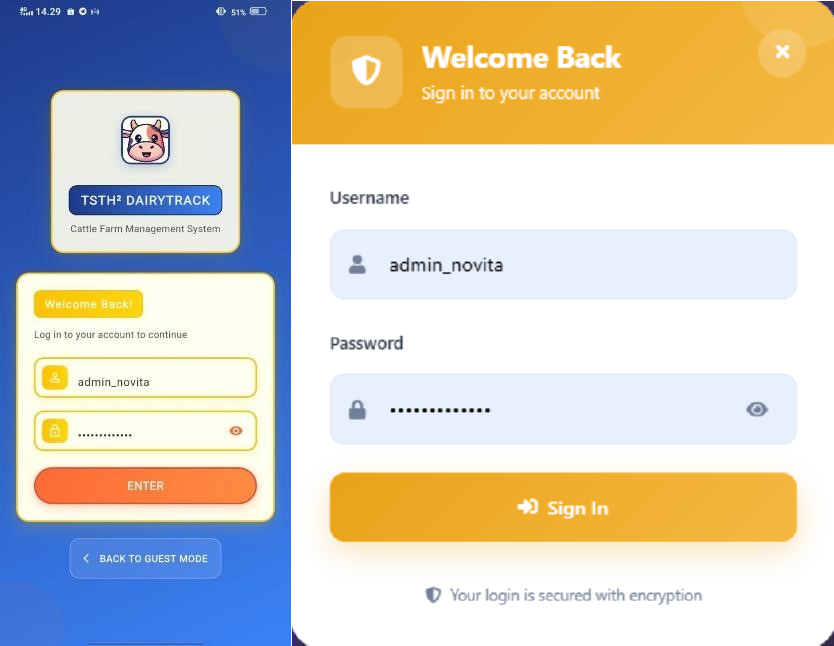

# DairyTrack

**DairyTrack** is an integrated dairy farm management system developed to support **TSTH² Pollung**, a new dairy farming initiative in North Sumatra. This system was built as part of my undergraduate thesis using the **prototyping method**, with direct involvement from users in the testing and feedback process.

## Project Overview

DairyTrack is designed to digitize and simplify dairy farming operations by providing digital solutions for:

- Milk Production Recording  
- Cattle Health Monitoring  
- Cattle Feeding Management  
- Product Sales and Distribution

This application helps farmers and admins manage livestock more efficiently while ensuring real-time updates and secure access.

## System Architecture

The system is composed of four integrated modules, each developed by different teams:

- **Milk Production** – built with Flask (my responsibility)  
- **Feeding Management** – built with Django  
- **Health Monitoring** – built with Django  
- **Sales & Marketing** – built with Node.js

All modules communicate through RESTful APIs and share a unified user and cattle data model.

## Key Features

- Role-based authentication and authorization  
- Secure login and JWT token management  
- Real-time notification system  
- Responsive and user-friendly interface (React and Flutter)  
- Unified cattle and user data structure  
- Modular and scalable backend architecture

## My Role

As the project leader, I designed and developed the entire **milk production module**, including:

- Full backend development using Flask  
- UI development in React (Web) and Flutter (Mobile)  
- Designing the shared cattle and user data model  
- Setting up authentication, authorization, and API gateway  
- Integrating with the three other modules from different stacks  
- Managing technical decisions and guiding other groups

This project strengthened my skills in full-stack development, system integration, and technical leadership.

## Built With

- **Backend:** Flask, Django, Node.js  
- **Frontend:** React.js, Flutter  
- **Database:** PostgreSQL  
- **Authentication:** JSON Web Token (JWT)  
- **Real-time:** WebSocket/Polling  

## Screenshots

| DairyTrack Interface Preview |
|-----------------------------|
|      |
|      |
|      |
|      |
|      |
|      |
|      |

## Client

This project was built specifically for **TSTH² Pollung**, a dairy farming startup that is just beginning operations in North Sumatra, Indonesia.

## License

This is part of an academic project. For any use or collaboration inquiries, please contact me.

---

Feel free to explore, give feedback, or contribute to the project.
